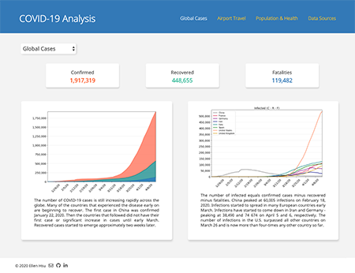
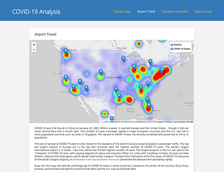

# COVID-19 Analysis
This project analyzes the current COVID-19 epidemic from three perspectives:
1.	Compares the confirmed, recovered, and fatality rates globally and by country.
2.	Maps COVID-19 “hotspots” and compares them to airport locations.
3.	Debunks some early myths about risk factors related to COVID-19. 

### Live Site
https://ellemonke.github.io/COVID-19

### Screenshots
<kbd></kbd><kbd></kbd> 

### Data Sources:
- ["Novel Coronavirus (COVID-19) Cases", CSSE at Johns Hopkins University on GitHub](https://github.com/CSSEGISandData/COVID-19/tree/master/csse_covid_19_data/csse_covid_19_time_series)
- ["Population", "Population Density", and "Regions", World Bank API](https://datahelpdesk.worldbank.org/knowledgebase/articles/889392-about-the-indicators-api-documentation)
- ["Burden of Disease", Our World In Data](https://ourworldindata.org/burden-of-disease)
- ["Busiest Airports by Passenger Traffic", data.gov.uk on data.world](https://data.world/datagov-uk/2ecd2a35-fc85-4cd9-b1e7-3a8f92d76fd7)
- ["Airports Finder" (Lat, Long), Rapid API](https://rapidapi.com/cometari/api/airportsfinder)
- ["U.S. States" (Lat, Long), Google Maps Geocoding API](https://developers.google.com/maps/documentation/geocoding/intro)

### Tech Stack
- Data analysis using Python (Pandas, NumPy, SciPy) and web API requests
- Visualizations using Matplotlib, Leaflet.js and D3.js
- Front-end web development using HTML, CSS, Bootstrap, JavaScript

### Potential Future Development
- Machine Learning Model predicting rate of spread - airports and tourist traffic as features
- Effect of health expenditure on fatality rate
- Risk assessment for Africa, India 
- Reduce dependencies:
    1. Replace need for [CSV to GeoJSON Converter](https://www.convertcsv.com/csv-to-geojson.htm) with Python or JavaScript.
    2. Convert website to Node.js environment
